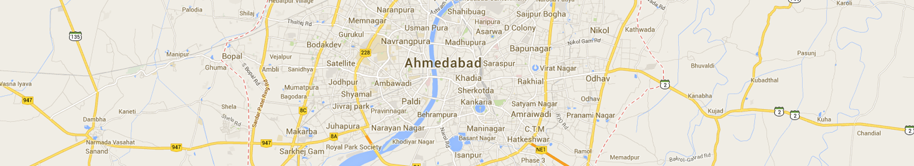

# karyna986.github.io
Modest
<html>
<head>
    <meta charset="utf-8">
    <link href="https://fonts.googleapis.com/css2?family=Open+Sans:wght@400;600&family=Quattrocento+Sans:wght@700&display=swap" rel="stylesheet">
    <link rel="stylesheet" href="./style.css">
    <title>Modest</title>
</head>
    
    
<body>

    <!-- social icons
    ========================-->

<svg style="display: none;">
    <symbol id="point" viewBox="0 0 512 512">
        <g>
            <path d="M73.143,182.857C32.812,182.857,0,215.67,0,256c0,40.33,32.812,73.143,73.143,73.143c40.33,0,73.143-32.813,73.143-73.143
                C146.286,215.67,113.473,182.857,73.143,182.857z M73.143,310.857c-30.25,0-54.857-24.607-54.857-54.857
                s24.607-54.857,54.857-54.857C103.393,201.143,128,225.75,128,256S103.393,310.857,73.143,310.857z"/>
        </g>
    </symbol>
    <symbol id="facebook" viewBox="0 0 430.113 430.114">
        <g>
            <path d="M158.081,83.3c0,10.839,0,59.218,0,59.218h-43.385v72.412h43.385v215.183h89.122V214.936h59.805
                c0,0,5.601-34.721,8.316-72.685c-7.784,0-67.784,0-67.784,0s0-42.127,0-49.511c0-7.4,9.717-17.354,19.321-17.354
                c9.586,0,29.818,0,48.557,0c0-9.859,0-43.924,0-75.385c-25.016,0-53.476,0-66.021,0C155.878-0.004,158.081,72.48,158.081,83.3z"/>
        </g>
    </symbol>

    <symbol id="twitter" viewBox="0 0 612 612">
        <g>
            <path d="M612,116.258c-22.525,9.981-46.694,16.75-72.088,19.772c25.929-15.527,45.777-40.155,55.184-69.411
                c-24.322,14.379-51.169,24.82-79.775,30.48c-22.907-24.437-55.49-39.658-91.63-39.658c-69.334,0-125.551,56.217-125.551,125.513
                c0,9.828,1.109,19.427,3.251,28.606C197.065,206.32,104.556,156.337,42.641,80.386c-10.823,18.51-16.98,40.078-16.98,63.101
                c0,43.559,22.181,81.993,55.835,104.479c-20.575-0.688-39.926-6.348-56.867-15.756v1.568c0,60.806,43.291,111.554,100.693,123.104
                c-10.517,2.83-21.607,4.398-33.08,4.398c-8.107,0-15.947-0.803-23.634-2.333c15.985,49.907,62.336,86.199,117.253,87.194
                c-42.947,33.654-97.099,53.655-155.916,53.655c-10.134,0-20.116-0.612-29.944-1.721c55.567,35.681,121.536,56.485,192.438,56.485
                c230.948,0,357.188-191.291,357.188-357.188l-0.421-16.253C573.872,163.526,595.211,141.422,612,116.258z"/>
        </g>
    </symbol>

    <symbol id="linkedin" viewBox="0 0 310 310">
        <g>
            <path id="XMLID_802_" d="M72.16,99.73H9.927c-2.762,0-5,2.239-5,5v199.928c0,2.762,2.238,5,5,5H72.16c2.762,0,5-2.238,5-5V104.73
            C77.16,101.969,74.922,99.73,72.16,99.73z"/>
        <path id="XMLID_803_" d="M41.066,0.341C18.422,0.341,0,18.743,0,41.362C0,63.991,18.422,82.4,41.066,82.4
            c22.626,0,41.033-18.41,41.033-41.038C82.1,18.743,63.692,0.341,41.066,0.341z"/>
        <path id="XMLID_804_" d="M230.454,94.761c-24.995,0-43.472,10.745-54.679,22.954V104.73c0-2.761-2.238-5-5-5h-59.599
            c-2.762,0-5,2.239-5,5v199.928c0,2.762,2.238,5,5,5h62.097c2.762,0,5-2.238,5-5v-98.918c0-33.333,9.054-46.319,32.29-46.319
            c25.306,0,27.317,20.818,27.317,48.034v97.204c0,2.762,2.238,5,5,5H305c2.762,0,5-2.238,5-5V194.995
            C310,145.43,300.549,94.761,230.454,94.761z"/>
        </g>
    </symbol> 

    <symbol id="behance" viewBox="0 0 511.958 511.958" > 
        <g>
			<path d="M210.624,240.619c10.624-5.344,18.656-11.296,24.16-17.728c9.792-11.584,14.624-26.944,14.624-45.984
				c0-18.528-4.832-34.368-14.496-47.648c-16.128-21.632-43.424-32.704-82.016-33.28H0v312.096h142.56
				c16.064,0,30.944-1.376,44.704-4.192c13.76-2.848,25.664-8.064,35.744-15.68c8.96-6.624,16.448-14.848,22.4-24.544
				c9.408-14.656,14.112-31.264,14.112-49.76c0-17.92-4.128-33.184-12.32-45.728C238.912,255.627,226.752,246.443,210.624,240.619z
				 M63.072,150.187h68.864c15.136,0,27.616,1.632,37.408,4.864c11.328,4.704,16.992,14.272,16.992,28.864
				c0,13.088-4.32,22.24-12.864,27.392c-8.608,5.152-19.776,7.744-33.472,7.744H63.072V150.187z M171.968,348.427
				c-7.616,3.68-18.336,5.504-32.064,5.504H63.072v-83.232h77.888c13.568,0.096,24.128,1.888,31.68,5.248
				c13.44,6.08,20.128,17.216,20.128,33.504C192.768,328.651,185.856,341.579,171.968,348.427z"/>
			<rect x="327.168" y="110.539" width="135.584" height="38.848"/>
			<path d="M509.856,263.851c-2.816-18.08-9.024-33.984-18.688-47.712c-10.592-15.552-24.032-26.944-40.384-34.144
				c-16.288-7.232-34.624-10.848-55.04-10.816c-34.272,0-62.112,10.72-83.648,32c-21.472,21.344-32.224,52.032-32.224,92.032
				c0,42.656,11.872,73.472,35.744,92.384c23.776,18.944,51.232,28.384,82.4,28.384c37.728,0,67.072-11.232,88.032-33.632
				c13.408-14.144,20.992-28.064,22.656-41.728H446.24c-3.616,6.752-7.808,12.032-12.608,15.872
				c-8.704,7.04-20.032,10.56-33.92,10.56c-13.216,0-24.416-2.912-33.76-8.704c-15.424-9.28-23.488-25.536-24.512-48.672h170.464
				C512.16,289.739,511.52,274.411,509.856,263.851z M342.976,269.835c2.24-15.008,7.68-26.912,16.32-35.712
				c8.64-8.768,20.864-13.184,36.512-13.216c14.432,0,26.496,4.128,36.32,12.416c9.696,8.352,15.168,20.48,16.288,36.512H342.976z"
				/>
		</g>

    </symbol>

    <symbol id="dribbble"  viewBox="0 0 438.533 438.533">
        <g>
            <path d="M409.133,109.203c-19.608-33.592-46.205-60.189-79.798-79.796C295.736,9.801,259.058,0,219.273,0
                c-39.781,0-76.47,9.801-110.063,29.407c-33.595,19.604-60.192,46.201-79.8,79.796C9.801,142.8,0,179.489,0,219.267
                c0,39.78,9.804,76.463,29.407,110.062c19.607,33.592,46.204,60.189,79.799,79.798c33.597,19.605,70.283,29.407,110.063,29.407
                s76.47-9.802,110.065-29.407c33.593-19.602,60.189-46.206,79.795-79.798c19.603-33.596,29.403-70.284,29.403-110.062
                C438.533,179.485,428.732,142.795,409.133,109.203z M219.27,31.977c47.201,0,88.41,15.607,123.621,46.82l-3.569,4.993
                c-1.427,2.002-4.996,5.852-10.704,11.565c-5.709,5.708-11.943,11.136-18.699,16.274c-6.762,5.14-15.94,10.992-27.555,17.559
                c-11.611,6.567-23.982,12.328-37.117,17.276c-21.887-40.355-45.296-76.709-70.231-109.064
                C190.055,33.784,204.805,31.977,219.27,31.977z M72.524,103.06c18.271-23.026,40.537-40.73,66.806-53.1
                c23.601,31.405,46.82,67.381,69.662,107.921c-57.862,15.227-115.532,22.841-173.014,22.838
                C42.072,151.98,54.253,126.091,72.524,103.06z M44.54,286.794c-8.376-21.412-12.563-43.923-12.563-67.527
                c0-2.666,0.098-4.665,0.286-5.996c68.905,0,132.955-8.848,192.149-26.553c6.092,11.8,11.136,22.364,15.133,31.693
                c-0.771,0.38-1.999,0.806-3.713,1.283c-1.719,0.476-2.953,0.806-3.721,0.999l-10.561,3.711
                c-7.236,2.666-16.708,7.235-28.409,13.703c-11.704,6.478-24.123,14.182-37.257,23.13c-13.134,8.949-26.696,20.797-40.684,35.553
                c-13.99,14.75-25.743,30.591-35.26,47.53C64.713,327.381,52.914,308.2,44.54,286.794z M219.27,406.56
                c-44.54,0-84.32-14.277-119.343-42.825l4.283,3.142c6.661-14.66,16.462-28.746,29.408-42.257
                c12.944-13.511,25.41-24.413,37.401-32.695c11.991-8.274,25.028-16.077,39.115-23.414c14.084-7.323,23.691-11.991,28.835-13.983
                c5.14-1.998,9.233-3.572,12.278-4.716l0.568-0.287h0.575c18.647,48.916,31.977,96.313,39.968,142.184
                C268.756,401.611,244.397,406.557,219.27,406.56z M376.876,320.479c-14.086,21.796-31.696,39.834-52.817,54.104
                c-7.81-43.776-19.985-88.415-36.549-133.902c37.877-5.907,76.8-3.142,116.771,8.274
                C400.092,274.841,390.955,298.687,376.876,320.479z M403.706,216.698c-1.903-0.378-4.285-0.81-7.139-1.283
                c-2.854-0.473-6.331-1.047-10.424-1.713c-4.087-0.666-8.662-1.283-13.702-1.855c-5.045-0.571-10.421-1.093-16.136-1.569
                c-5.708-0.478-11.8-0.855-18.268-1.143c-6.479-0.284-13.042-0.428-19.705-0.428c-6.656,0-13.657,0.193-20.981,0.571
                c-7.326,0.375-14.414,1.049-21.265,1.999c-0.575-0.953-1.287-2.524-2.143-4.714c-0.855-2.187-1.479-3.855-1.848-4.997
                c-3.621-7.994-7.81-17.036-12.573-27.121c13.134-5.333,25.652-11.469,37.555-18.418c11.892-6.949,21.402-13.131,28.544-18.555
                c7.139-5.43,13.895-11.188,20.27-17.277c6.379-6.09,10.513-10.323,12.423-12.703c1.906-2.384,3.713-4.714,5.424-6.995l0.287-0.288
                c27.788,33.88,41.974,72.897,42.538,117.059L403.706,216.698z"/>
        </g>

    </symbol>

    <symbol id="google" viewBox="0 0 604.35 604.35">
        <g id="google">
            <path d="M423.301,341.7l-28.051-20.4c-10.199-7.649-20.4-17.85-20.4-35.7s12.75-33.15,25.5-40.8
                c33.15-25.5,66.301-53.55,66.301-109.65c0-53.55-33.15-84.15-51-99.45H459L489.6,0H331.5C219.3,0,163.2,71.4,163.2,147.9
                c0,58.65,45.9,122.4,127.5,122.4h20.4c-2.55,7.65-10.2,20.4-10.2,33.15c0,25.5,10.2,35.7,22.95,51
                c-35.7,2.55-102,10.2-150.45,40.8c-45.9,28.05-58.65,66.3-58.65,94.35c0,58.65,53.55,114.75,168.3,114.75
                c137.7,0,204.001-76.5,204.001-150.449C487.051,400.35,459,372.3,423.301,341.7z M229.5,109.65c0-56.1,33.15-81.6,68.85-81.6
                c66.3,0,102,89.25,102,140.25c0,66.3-53.549,79.05-73.949,79.05C262.65,247.35,229.5,168.3,229.5,109.65z M321.301,568.65
                C237.15,568.65,183.6,530.4,183.6,474.3c0-56.1,51-73.95,66.3-81.6c33.15-10.2,76.5-12.75,84.151-12.75c7.648,0,12.75,0,17.85,0
                c61.199,43.35,86.699,61.2,86.699,102C438.6,530.4,390.15,568.65,321.301,568.65z"/>
        </g>
    </symbol>

    <symbol id="skype" viewBox="0 0 24 24" >
            <g id="skype">
                <path d="m23.309 14.547c1.738-7.81-5.104-14.905-13.139-13.543-4.362-2.707-10.17.352-10.17 5.542 0 1.207.333 2.337.912 3.311-1.615 7.828 5.283 14.821 13.311 13.366 5.675 3.001 11.946-2.984 9.086-8.676zm-7.638 4.71c-2.108.867-5.577.872-7.676-.227-2.993-1.596-3.525-5.189-.943-5.189 1.946 0 1.33 2.269 3.295 3.194.902.417 2.841.46 3.968-.3 1.113-.745 1.011-1.917.406-2.477-1.603-1.48-6.19-.892-8.287-3.483-.911-1.124-1.083-3.107.037-4.545 1.952-2.512 7.68-2.665 10.143-.768 2.274 1.76 1.66 4.096-.175 4.096-2.207 0-1.047-2.888-4.61-2.888-2.583 0-3.599 1.837-1.78 2.731 2.466 1.225 8.75.816 8.75 5.603-.005 1.992-1.226 3.477-3.128 4.253z">
            </g>
    </symbol>

</svg>

     <!-- banner
    =========== -->

    
 
        

            

                
        

        

            <a class="nav__menu__home" href="##"> HOME </a>
            <a class="nav__menu" href="##"> about </a>
            <a class="nav__menu" href="##"> work </a>
            <a class="nav__menu" href="##"> TEAM  </a>
            <a class="nav__menu" href="##"> services </a>
            <a class="nav__menu" href="##"> FEATURES </a>
            <a class="nav__menu" href="##"> contact  </a>
        

        

    
 
    
     <!-- main
    ========== -->

    

        
 
                
        

        
        
 
            

                <h1 class="text__welcome"> welcome to our marketplace</h1>
                <h2 class="text__lorem"> Lorem ipsum dolor sit amet, consectetur adipiscing elit. Sed nisi metus, tristique ndolor 
                  non, ornare sagittis dolor. Nulla vestibulu lacus ...
                </h2>
            

            

                 

                        <a class="main__button__text">view more </a>
                         
 
                 

                        <a class="main__button__text">video tour </a>
                    

            

            

                <a class="item" href="#" target="_blank">
                    <svg class="icon">
                        <use xlink:href="#point"></use>
                    </svg>
                </a>

                <a class="item" href="#" target="_blank">
                    <svg class="icon">
                        <use xlink:href="#point"></use>
                    </svg>
                </a>

                <a class="item" href="#" target="_blank">
                    <svg class="icon">
                        <use xlink:href="#point"></use>
                    </svg>
                </a>

            

        

        
    

    <!-- we are modest
    =============== -->
  

      
 
            
 
                
  

                
 
                    <h1 class="modest__banner__text">we are modest. </h1>
                

            

            

                

                    
 
                        
Lorem ipsum dolor sit amet, consectetur adipiscing elit. Sed nisi metus, tristique ndolor non, ornare sagittis dolor. Nulla vestibulu lacus sed molestie gravida. Crferm entum  quismagna congue, vel sodales arcu vestibulum. Nunc lobortis dui magna, quis lacusullamcorper at.

                        
Phasellus sollicitudin ante eros ornare, <b> sit amet luctus lorem semper</b>. Suspendisse posuere, quamdictum consectetur, augue metus pharetra tellus, eu feugiatloreg egetnisi. Cras ornare bibendum ante, ut bibendum odio convallis eget. vel sodales arcu vestibulum

                    
     

            <!-- social icons -->
                    

                           
                            <a class="social__item" href="#" target="_blank">
                                <svg class="social__icon">
                                    <use xlink:href="#facebook"></use>
                                </svg>
                            </a>

                            <a class="social__item" href="#" target="_blank">
                                <svg class="social__icon">
                                    <use xlink:href="#twitter"></use>
                                </svg>
                            </a>

                            <a class="social__item" href="#" target="_blank">
                                <svg class="social__icon">
                                    <use xlink:href="#google"> </use>
                                </svg>
                            </a>

                            <a class="social__item" href="#" target="_blank">
                                <svg class="social__icon">
                                    <use xlink:href="#dribbble"> </use>
                                </svg>
                            </a>
                            
                            <a class="social__item" href="#" target="_blank">
                                <svg class="social__icon">
                                    <use xlink:href="#behance"></use>
                                </svg>
                            </a>
                        
                    
 <!--  modest__icons-->

                

                

                    

                           
 <a class="left" href=""> 01 </a> 
 
                           
 <a class="left" href=""> 02 </a> 
 
                           
 <a class="left" href=""> 03 </a> 
 
                        

                    

                        <h3 class="right__text_1">Dedication to the customers </h3>
                        
Integer vel lacus non dui ullamcorper venenatis. Aliquam vitae tristique nisi, vitae ullamcorper risus

                        <h3 class="right__text_1">working closely with our clients</h3>
                        
Sed blandit nisi urna, sed pellentesque enim consectetur vitae. Suspendisse ut vehicula nibh

                        <h3 class="right__text_1">increase happiness</h3>
                        
Lorem ipsum dolor sit amet, consectetur adipiscing elit. Nulla eleifend laoreet euismod

                        

                

        
 <!-- modest__main  -->
    

 
  <!-- закрыли  modest -->

    <!-- Team 
=====================-->

    

       

            
  

            
 
                
meet the team.

            

        

 

           

                

                    
                

                

                            
CLORIA BROMLEY

                             
CEO and Founder

                        

                            
CLORIA BROMLEY

                            
CEO and Founder

                         

                 
 
              
                 

                    

                            <a class="team__item" href="#" target="_blank">
                                <svg class="team__social__icon">
                                    <use xlink:href="#twitter"></use>
                                </svg>
                            </a>
                            <a class="team__item" href="#" target="_blank">
                                <svg class="team__social__icon">
                                    <use xlink:href="#facebook"></use>
                                </svg>
                            </a>
                            <a class="team__item" href="#" target="_blank">
                                <svg class="team__social__icon">
                                    <use xlink:href="#linkedin"> </use>
                                </svg>
                            </a> 
                    
           
                
 <!--team__icons -->
          
   <!--team__foto -->

         

                

                     
                

                

                        
Paul Torres

                        
Head of Development

                    

                        
Paul Torres

                        
Head of Development

                    

                
 

                

                    

                        <a class="team__item" href="#" target="_blank">
                            <svg class="team__social__icon">
                                <use xlink:href="#twitter"></use>
                            </svg>
                        </a>
                        <a class="team__item" href="#" target="_blank">
                            <svg class="team__social__icon">
                                <use xlink:href="#facebook"></use>
                            </svg>
                        </a>
                        <a class="team__item" href="#" target="_blank">
                            <svg class="team__social__icon">
                                <use xlink:href="#linkedin"> </use>
                            </svg>
                        </a>
                    

                
 <!--team__icons -->
        
  <!--team__foto -->

            

                

                    
               

                

                        
Judith Gillette

                        
Graphic Desinger

                    

                        
Judith Gillette

                        
Graphic Desinger

                    

                
 
                

                    

                        <a class="team__item" href="#" target="_blank">
                            <svg class="team__social__icon">
                                <use xlink:href="#twitter"></use>
                            </svg>
                        </a>
                        <a class="team__item" href="#" target="_blank">
                            <svg class="team__social__icon">
                                <use xlink:href="#facebook"></use>
                            </svg>
                        </a>
                        <a class="team__item" href="#" target="_blank">
                            <svg class="team__social__icon">
                                <use xlink:href="#linkedin"> </use>
                            </svg>
                        </a>
                    

                
 <!--team__icons -->
             
  <!--team__foto -->

            

                

                    
               

                

                        
Delores Reed

                        
Client Service Director

                    

                        
Delores Reed

                        
Client Service Director

                    

                
 
                

                    

                        <a class="team__item" href="#" target="_blank">
                            <svg class="team__social__icon">
                                <use xlink:href="#twitter"></use>
                            </svg>
                        </a>
                        <a class="team__item" href="#" target="_blank">
                            <svg class="team__social__icon">
                                <use xlink:href="#facebook"></use>
                            </svg>
                        </a>
                        <a class="team__item" href="#" target="_blank">
                            <svg class="team__social__icon">
                                <use xlink:href="#linkedin"> </use>
                            </svg>
                        </a>
                    

                
 <!--team__icons -->
            
 <!--team__foto -->

        

    

 <!--team -->

        <!-- lovely work -->

    

        

            
  

            
 
                <h3 class="work__top__text"> lovely work. </h3>
            

        

        

            

                    
 
                            
 
                                
                            

                            

                                    

                                        
 + 

                                    

                                    

                                        
 partnership guidlines 

                                    

                            

                    

                    
 
                        
 
                            
                        

                        

                                

                                    
 + 

                                

                                

                                    
 partnership guidlines 

                                

                        

                

                
 
                    
 
                        
                    

                    

                            

                                
 + 

                            

                            

                                
 partnership guidlines 

                            

                    

                
      
          

        

            
 
                    
 
                        
                    

                    

                            

                                
 + 

                            

                            

                                
 partnership guidlines 

                            

                    

            

            
 
                
 
                    
                

                

                        

                            
 + 

                        

                        

                            
 partnership guidlines 

                        

                

             

             
 
                
 
                    
                

                

                        

                            
 + 

                        

                        

                            
 partnership guidlines 

                         

                

            
    
        

 

        
        

            

                <a  class="work_button_text" href=""> show more </a>
            

        

    

 
 <!--lovely work -->

 <!-- what we do 
====================== -->

    

        

                
  

                
 
                    <h3 class="SERVICES_top__text"> what we do. </h3>
                

        

        

            

                
                <h3 class="SERVICES__info__text_1">Easy theme Setup</h3>
                
Nunc mattis lorem in leo lobortis, ut venenatis justo commodo. Maecenas a justo nec velit egestas fermentum

            

            

                
                <h3 class="SERVICES__info__text_1">pixel perfect design</h3>
                
Nunc mattis lorem in leo lobortis, ut venenatis justo commodo. Maecenas a justo nec velit egestas fermentum

            

            

                
                <h3 class="SERVICES__info__text_1">responsive display</h3>
                
Nunc mattis lorem in leo lobortis, ut venenatis justo commodo. Maecenas a justo nec velit egestas fermentum

            

            

                
                <h3 class="SERVICES__info__text_1">24/7 support</h3>
                
Nunc mattis lorem in leo lobortis, ut venenatis justo commodo. Maecenas a justo nec velit egestas fermentum

            

        

       
        

            

                
                <h3 class="SERVICES__info__text_1">Easy theme Setup</h3>
                
Nunc mattis lorem in leo lobortis, ut venenatis justo commodo. Maecenas a justo nec velit egestas fermentum

            

            

                
                <h3 class="SERVICES__info__text_1">pixel perfect design</h3>
                
Nunc mattis lorem in leo lobortis, ut venenatis justo commodo. Maecenas a justo nec velit egestas fermentum

            

            

                
                <h3 class="SERVICES__info__text_1">responsive display</h3>
                
Nunc mattis lorem in leo lobortis, ut venenatis justo commodo. Maecenas a justo nec velit egestas fermentum

            

            

                
                <h3 class="SERVICES__info__text_1">24/7 support</h3>
                
Nunc mattis lorem in leo lobortis, ut venenatis justo commodo. Maecenas a justo nec velit egestas fermentum

            

        

       
    

 <!-- what we do  -->

    <!--  FEATURES
======================= -->

    

        

                
  

                    

                    <h3 class="container__top__text"> FEATURES. </h3>
                

        

        

            
 
                    
                    <h3 class="FEATURES_main__info__text__1"> Product Design: Eames Chairs  </h3>
                    
 Eames designs are certainly iconic. Everyone of us know at least two or three of their famous chairs. I would even risk saying that most of us dream about having a nice Eames. 

            

            
 
                
                <h3 class="FEATURES_main__info__text__1"> Elegant and Colorful Logos </h3>
                
 I’ve always found logo design to be one of the most challenging things to get right. There’s so much that a logo can say about a brand without actually saying it.

            

            
 
                
                <h3 class="FEATURES_main__info__text__1"> A Showcase of Creative </h3>
                
 It’s always interesting to see another designer’s take on a famous website, app or even physical product. Different designers add their own personality and style. 

             

        

    

 <!-- FEATURES -->

        <!-- stay in touch
==========================  -->

        
 
            
  

                

                    <h3 class="CONTACT_top__text"> stay in touch. </h3>
                

        

        

                
        

        

                
 
                        <h3 class="bottom__right__text_1"> contact information </h3> 
                        
 Lorem ipsum dolor sit amet, consectetur adipiscing elit. Sed nisi metus, tristique nec dolor non, ornare sagittis dolor. Nulla vestibulum lacus sed molestie gravida 

                        
 Cras fermentum elit quis magna congue, <b>vel sodales</b>  arcu vestibulum. Nunc lobortis dui magna, quis dapibus lacus  

                

                

                        

                            

                                

                                     
 Your Name 

                                  
 
                                
  

                            

                            

                                

                                    
 Your email 

                                  
 
                                
 

                            

                        

                        

                                

                                    
 Your message 

                                  

                                
  

                        

                        

                            
 
                                    <a class="left__button_text" href=""> send message </a>
                            

                        

                

        
   
 
 <!-- CONTACT -->

    <!-- FOOTER
 ================= -->

    

            

                
 © Copyright 2014 by PSD Booster. All Rights Reserved. 

            

            

                
                    
 
                        <a class="FOOTER__item" href="#" target="_blank">
                            <svg class="FOOTER__social__icon">
                                <use xlink:href="#twitter"></use>
                            </svg>
                        </a>

                        <a class="FOOTER__item" href="#" target="_blank">
                            <svg class="FOOTER__social__icon">
                                <use xlink:href="#facebook"></use>
                            </svg>
                        </a>

                        <a class="FOOTER__item" href="#" target="_blank">
                            <svg class="FOOTER__social__icon">
                                <use xlink:href="#skype"></use>
                            </svg>
                        </a>

                        <a class="FOOTER__item" href="#" target="_blank">
                            <svg class="FOOTER__social__icon">
                                <use xlink:href="#behance"> </use>
                            </svg>
                        </a>
                        
                        <a class="FOOTER__item" href="#" target="_blank">
                            <svg class="FOOTER__social__icon">
                                <use xlink:href="#linkedin"></use>
                            </svg>
                        </a>
                    
                
 <!--  modest__icons-->
            

    

 
 <!--FOOTER -->

</body>
     
</html>
